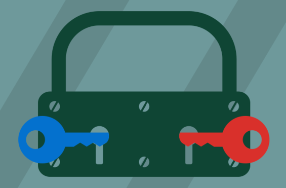
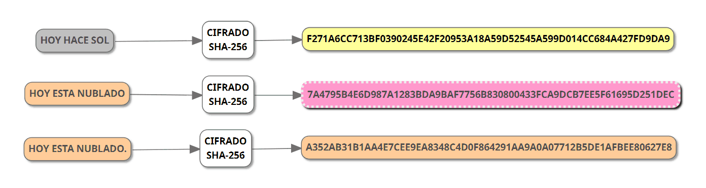
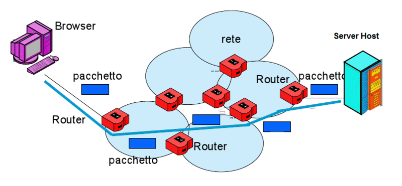

# Progetto

## 1. *Progetto* iniziale:
> L'applicazione che andremo a creare eseguirà una serie di controlli che permetteranno di stabilire se un file scaricato da Internet è stato manomesso.
> Il primo step consisterà nell'inserimento della chiave pubblica da parte dell'utente con cui verrà aperto il file contenente il checksum SHA256 che verrà mostrato sull'interfaccia.
> Successivamente il checksum ottenuto verrà confrontato con il checksum SHA256 del file importato, calcolato dalla nostra applicazione.
> In caso di uguaglianza dei due SHA256 il programma mostrerà un messaggio di successo, viceversa verranno segnalati gli errori riscontrati.

## 2. *Organizzazione* e suddivisione del lavoro:
> Il lavoro che andremo a svolgere verrà suddiviso principalmente in 3 fasi:
> - **Fase 1** (Interfaccia wpf): Eseguita da Rughetta Mattia, usufruendo di 2 ore in laboratorio; 
> 
> In questa fase verrà realizzata la pagina che interfaccerà l'utente all'applicazione.
>  
> - **Fase 2** (Calcolo del cheksum SHA256): Eseguito da Cancemi Gabriele con l'aiuto del gruppo, servendosi di 4 ore in laboratorio;
> 
> Scriveremo il codice che calcolerà il checksum SHA256 del file che l'utente inserirà in input.  
> 
> - **Fase 3** (Controllo della firma digitale): Eseguito da Soudqi Nizar, aiutato dal resto del gruppo, beneficiando di 4 ore in laboratorio;
> 
> Decifreremo il checksum criptato che l'utente inserirà in input con la chiave pubblica fornita e andremo a confrontare i due codici in modo da ricavare l'eventuale autenticità del file firmato.
> 
> - **Fase 4** (Check-up finale del prodotto): Eseguito da tutti i membri del gruppo, in 1 ora di laboratorio.
> 
> Controlleremo il totale funzionamento dell'applicazione, correggendo eventuali errori. 
> 
> Ipoteticamente il lavoro dovrebbe essere completato entro il 06/04/2022.

## 3. *Documentazione* del processo di realizzazione:
> Per la documentazione del processo di realizzazione utilezzeremo il software "GitHub" e la relativa applicazione "GitHub Desktop", all'interno dei quali andremo a descrivere ogni modifica effettuata al progetto utilizzando i "Commit".
> Per ogni commit inseriremo un titolo e una sintesi del lavoro svolto, in modo da tener traccia di ogni progresso.

## 4. *Collegamenti* e relazioni tra ciò che si sta realizzando e le informazioni di riferimento:
> Il progetto che andremo a realizzare tratterà argomenti collegati ad altre materie:
> - **Sistemi e reti** - Protocollo PGP che viene utilizzato per inviare messaggi crittografati tra due persone mediante l'utilizzo di una chiave pubblica legata a un utente specifico;
>
> 
>
> - **Tpsit** - Calcolo del checksum, ovvero una sequenza di 64 cifre esadecimali che viene utilizzata per verificare l'integrità di un file. In caso di modifica di anche un solo bit del documento, il checksum risulterà completamente diverso rispetto al precedente potendo così identificare un'eventuale manomissione;
>
>  
>
> - **Telecomunicazioni** - Commutazione di un pacchetto, tecnica che prevede la suddivisione di un messaggio in più parti (pacchetti), prima di inoltrarlo attraverso un percorso non definito. Ogni dato seguirà una propria strada prima di raggiungere il destinatario, rendendo così possibili delle azioni di modifica del documento durante la trasmissione.
>
> 
>
> Esistono sul web molti siti che permettono di calcolare l'SHA256 di un file importato dal pc. In particolare per la realizzazione del nostro progetto utilizzeremo come base di riferimento la seguente [pagina](https://emn178.github.io/online-tools/sha256.html).
> 
> Per quanto riguarda il controllo della firma digitale abbiamo trovato il seguente [sito](https://8gwifi.org/pgpencdec.jsp) che permette la criptazione e la decriptazione di un testo mediante l'utlizzo della chiave pubblica PGP.
> 
> La nostra applicazione unirà il funzionamento di entrambi i software, al fine di eseguire tutti i controlli utilizzando un'unica piattaforma.
> 
> Gli argomenti trattati in teoria che verranno ripresi nella creazione di questa applicazione sono principalmente:
> - **Metodi** - Utilizzo di codice già presente in Visual Studio, scritto da altri programmatori (Es. decriptazione con chiave PGP);
> - **Checksum SHA256** - Verifica l'integrità di un file. Nel nostro progetto deve essere calcolato dal programma;
> - **Chiavi asimmetriche** - Utilizzte per la comunicazione sicura tra due parti. In paricolare noi utilizzeremo solo la chiave pubblica che ci permetterà di decifrare un codice cifrato dal proprietario mediante la chiave privata.

